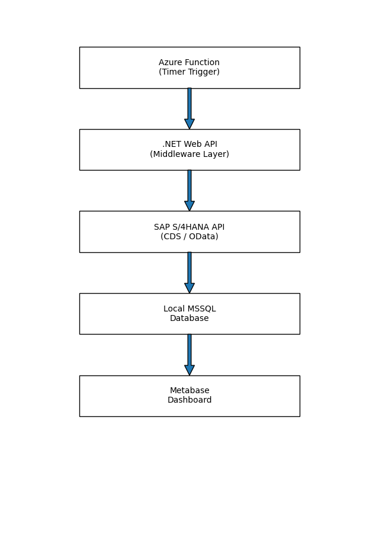

# 📊 Sales & Production Planning Analytics Dashboard  
### SAP S/4HANA → Azure → MSSQL → Metabase

## 📌 Project Overview

This project demonstrates an end-to-end data engineering and analytics pipeline built using **SAP S/4HANA, Azure, MSSQL, and Metabase**.

The goal was to extract sales and production planning data from SAP S/4HANA using parameterized CDS Views, automate data ingestion via Azure Functions, ensure data integrity in MSSQL, and build meaningful business dashboards in Metabase.

---

## 🏗️ Architecture Overview

SAP S/4HANA (CDS View)  
→ Custom API (JSON Extraction)  
→ Azure Function (Scheduled Execution)  
→ Local MSSQL Database  
→ Metabase Dashboard 
.NET Web API (Middleware)  

---
 
## 🏗️ Architecture Diagram

--
## 🔧 Technology Stack

- SAP S/4HANA
- ABAP CDS Views (Parameterized)
- OData / Custom API
- .NET Web API (Middleware)  
- Azure App Function (Timer Trigger)
- Microsoft SQL Server (Local)
- Metabase (BI & Visualization)

---

## ⚙️ Implementation Details

### 1️⃣ Parameterized CDS View Creation (SAP S/4HANA)

- Developed parameterized CDS views in Eclipse (ABAP Development Tools).
- Extracted:
  - Sales data
  - Production planning data
- Applied business logic inside CDS layer for optimized querying.
- Ensured performance optimization using proper indexing and filters.

---

### 2️⃣ API Development for JSON Extraction

- Built a custom API to:
  - Consume CDS view
  - Extract data in JSON format
- Implemented:
  - Structured response schema
  - Error handling
  - Secure endpoint access

---

### 3️⃣ Azure Function (Scheduled Data Pipeline)

- Developed an Azure App Function with **Timer Trigger**.
- Automated periodic API execution.
- Handled:
  - Incremental data load
  - Logging and monitoring
  - Failure handling & retry mechanism

---

### 4️⃣ Data Storage in Local MSSQL

- Designed relational schema for:
  - Sales transactions
  - Production planning records
- Implemented:
  - Primary & foreign keys
  - Deduplication logic
  - Data validation rules
  - Data integrity constraints
- Ensured:
  - Accuracy
  - Consistency
  - No duplication
  - Historical tracking (if applicable)

---

### 5️⃣ Metabase Dashboard Development

Connected MSSQL database with Metabase and built:

#### 📈 Sales Analytics Dashboard
- Total Sales
- Monthly Sales Trend
- Product-wise Sales Performance
- Region-wise Sales Distribution
- Order Fulfillment Metrics

#### 🏭 Production Planning Dashboard
- Production vs Target
- Monthly Production Volume Trend
- Yearly Production Performance Summary
- Month-over-Month (MoM) Growth Analysis
- Year-over-Year (YoY) Comparison
- Production Volume by Order Type
- Scrap Quantity & Scrap % Trend (Monthly/Yearly)

---

## 🎯 Key Achievements

- Built a complete ETL-style pipeline from SAP to BI layer
- Automated data extraction & refresh process
- Ensured high data quality & consistency
- Delivered business-ready dashboards for decision-making
- Reduced manual reporting dependency

---

## 🧠 Learning Outcomes

- Deep understanding of SAP CDS architecture
- API-based data extraction strategy
- Azure serverless automation
- Data modeling in MSSQL
- Business dashboard storytelling using Metabase

---

## 🚀 Future Improvements

- Implement CI/CD for API & Azure Function
- Move MSSQL to Azure SQL for scalability
- Add role-based access control (RBAC)
- Implement real-time streaming instead of batch
- Add alerting & anomaly detection layer

---

## 👤 Author

**Niaz Morshed**  
Software Developer(C#, ABAP)
Data Engineering & Analytics Enthusiast  
SAP | Azure | SQL | BI | Data Pipelines  

---

## 🧠 Ideal Audience

- Students transitioning from SAP/ABAP to Data Engineering
- Professionals learning real-world ETL architecture
- Hiring managers evaluating end-to-end data pipeline expertise
- BI teams exploring SAP-to-Cloud integration strategies

---

